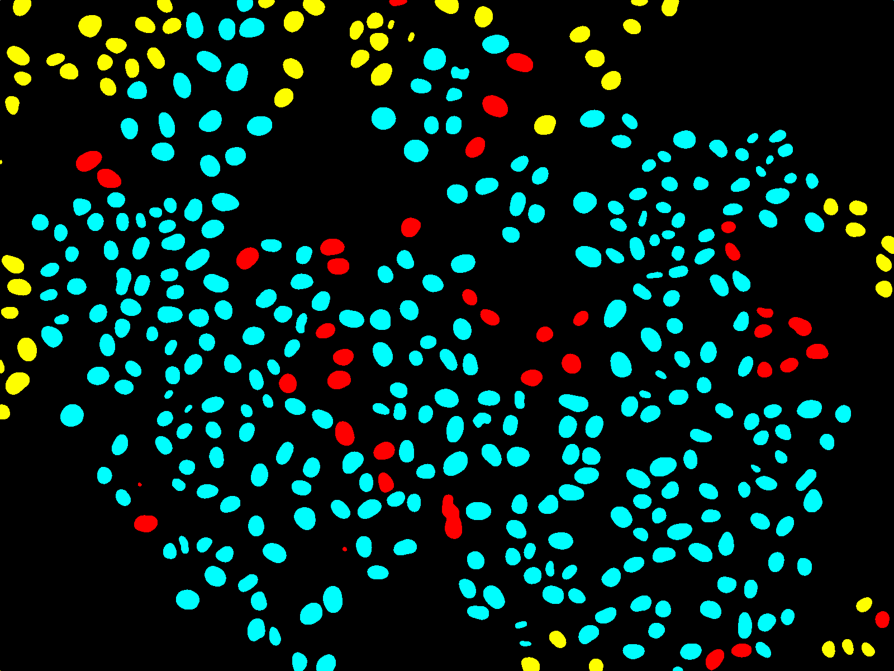

# 🌳 *DeepTree* 🌳

- **tracking_performance:**
   + learn how tracking results can be interpreted on image segmentation masks of low-contrast microscopy images
   + evaluate how well our `bTrack` tracking pipeline maintains the identities & trajectories of individual cells over long periods of time
   + visualise which cells can be tracked back to the very beginning of the movie (*survivor*; cyan), which cells migrated into the field of view (*incomer*; yellow), and where track breakage occurred (*mistrack*; red) to quickly identify & correct tracking errors

**Separation of Cells based on Their Tracking Status** -> _A colourised binary mask of a time-lapse microscopy field of view of medium confluency with individual cells highlighted as **survivors** if they can be tracked since the initial movie frame (cyan), **incomers** if they migrated into the field of view throughout the movie (yellow) or **mistracks** if an error occurred in the automated trajectory reconstruction (red)._

### Authors, Acknowledgments & Credits

The code committed to this repository was written by Kristina Ulicna (see the [LICENSE.md](../LICENSE.md "Kristina's LICENSE.md file") for more details) and sources from our custom-designed `CellTracking` library ([CellTracking on Github](https://github.com/quantumjot/CellTracking "Cell Tracking Repository" )), which was developed for microscopy data analysis by Dr Alan R. Lowe at UCL. For more information see our [CellX group website](http://lowe.cs.ucl.ac.uk/cellx.html "CellX group website").

If you are interested to learn more, please -> ⭐ <- the repository & don't hesitate to contact me directly via [email](mailto:kristina.smith.ulicna@gmail.com "Click to Email Me") or my [LinkedIn](https://www.linkedin.com/in/kristinaulicna/ "Kristina's LinkedIn Profile") or [Twitter](https://twitter.com/KristinaUlicna "Kristina's Twitter Profile") profile.
